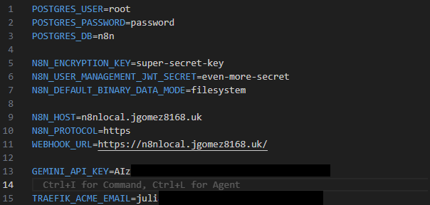
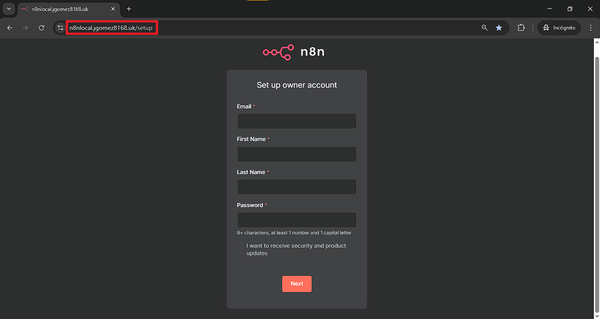
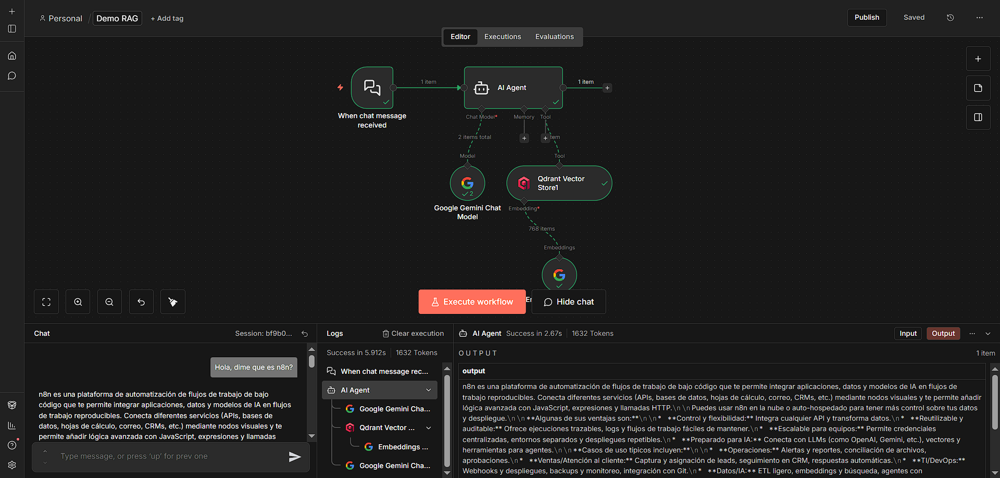

# n8n (Docker Compose)

Despliegue de n8n con PostgreSQL y base de datos vectorial: Integración de colecciones de embeddings y exposición segura mediante Cloudflare Tunnel.

### ¿Qué incluye?

✅ [**n8n**](https://n8n.io/) - Plataforma low-code con más de 400 integraciones y componentes avanzados para IA.

✅ [**Qdrant**](https://qdrant.tech/) - Base de datos vectorial open-source de alto rendimiento, con una API completa para búsqueda semántica y RAG.

✅ [**PostgreSQL**](https://www.postgresql.org/) -  El motor del mundo de la ingeniería de datos, maneja grandes volúmenes de información de forma segura y confiable.

✅ [**Cloudflare Tunnel**](https://developers.cloudflare.com/cloudflare-one/networks/connectors/cloudflare-tunnel/) - Expone tus servicios en la web de forma segura sin abrir puertos, ideal para publicar n8n y otros servicios internos.

## Requisitos

Necesitas un servidor **VPS o local** con:

- **Git** (para clonar el repositorio)
- **Docker** instalado
- **Docker Compose** (plugin `docker compose`)

Además:

- **Cloudflare Tunnel Token** (obligatorio si vas a exponer n8n por Cloudflare)
  - Sigue el paso a paso del repositorio: [n8n-cloudflare-docker-compose](https://github.com/jgomez8168-maker/n8n-cloudflare)
- **Gemini API Key** *(opcional, solo si quieres probar el flujo demo)*  
  - Crea tu API Key aquí: [Google AI Studio](https://aistudio.google.com/apikey?hl=es-419)

## Instalación y despliegue

### 1) Clonar el repositorio

```bash
git clone https://github.com/jgomez8168-maker/n8n-starter.git
cd n8n-starter
cp .env.example .env # aqui debes configurar todas las variables
```

### 2) Configurar variables de entorno (.env)
Edita el archivo .env y ajusta estas variables:

- N8N_HOST=n8n.yourdomian.uk Nombre del host configurado en Cloudflare (tu subdominio/dominio).

- WEBHOOK_URL=https://n8n.yourdomian.uk/ Debe ser la URL pública que va a usar n8n para webhooks.

- GEMINI_API_KEY=your-api-key (opcional) Pega tu API key si quieres probar el flujo demo.

- CLOUDFLARE_TUNNEL_TOKEN=your-cloudflare-token Token del último paso en Cloudflare Tunnel (del repo guía).


El archivo .env debería quedar:


### 3) Levantar los contenedores
Desde la raíz del proyecto:

```bash
docker compose pull
docekr compose create && docker compose up -d
```
Verifica que todo esté corriendo:

```bash
docker compose ps
docker compose logs -f
```
## 4) Abrir n8n

Ahora abre en tu navegador:
https://N8N_HOST
(Ejemplo: https://n8n.tudominio.com)

Si todo está bien, deberías ver la pantalla inicial de n8n.

## Inicio rápido y uso

Este proyecto despliega **n8n** usando **Docker Compose**, con una configuración pensada para **producción**:

- ✅ n8n accesible desde Internet mediante **Cloudflare Tunnel** (según tu configuración).
- ✅ **Base de datos vectorial** (vector DB) ya integrada para flujos tipo RAG.
- ✅ Carpeta **`documents/`** disponible para cargar archivos de forma controlada (sin tener que exponerlos públicamente).

Una vez completes los pasos de instalación y despliegue, en pocos minutos tendrás un entorno listo para trabajar.

### 1) Abrir n8n por primera vez

Abre tu navegador en la URL pública configurada (por ejemplo):

- `https://n8n.tudominio.com`

La configuración inicial de n8n **solo se realiza una vez**.


### 2) Ejecutar el flujo demo (opcional: Gemini)

Si configuraste la variable `GEMINI_API_KEY` en tu `.env`, podrás ejecutar el flujo de ejemplo incluido:

1. En n8n, abre el workflow **`Demo RAG`**.
2. Haz clic en **Execute workflow** (abajo del lienzo/canvas) para iniciarlo.

📌 ¿Qué hace este workflow?
- Toma el archivo de ejemplo ubicado en la carpeta **`documents/`**
- Genera los **embeddings**
- Crea/actualiza una **colección** en la base de datos vectorial para habilitar búsquedas tipo RAG


### 3) Probar el chat

1. Abre el chat (si está colapsado, usa **Hide/Show chat** para mostrarlo).
2. Hazle preguntas a la IA sobre el contenido del documento cargado.


### Tips

- Si agregas nuevos archivos en `documents/`, vuelve a ejecutar el workflow para regenerar embeddings/colección.


